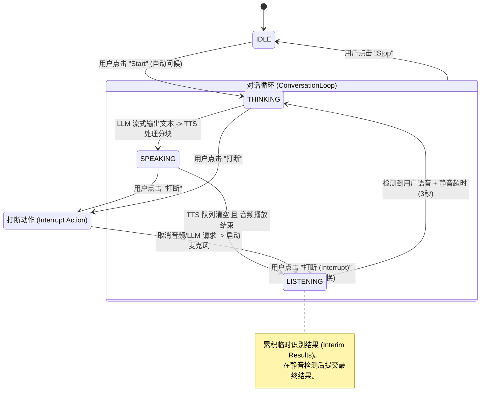

| **IDLE** (空闲) | 应用程序正在等待用户交互。此时没有音频处理或网络请求处于活动状态。 | 显示 "Start" 按钮。头像静止。 |

| **THINKING** (思考中) | LLM 正在生成文本 (流式传输)。系统正在缓冲文本以供 TTS 使用。 | 跳动的圆点动画。头像快速呼吸/脉动。 |

| **SPEAKING** (说话中) | 应用程序正在播放合成的语音 (TTS)。 | 声波均衡器动画。头像根据音量大小形变。 |

| **LISTENING** (聆听中) | 麦克风已激活，正在通过 Web Speech API 捕获用户语音。 | 脉冲式麦克风图标。头像发光/扩散 ping 动画。 |

## 2. 交互流程详解

  

### A. 标准对话流程 (The "Happy Path")

  

1.  **初始化**:

    *   用户点击 **Start**。

    *   调用 `startConversation()`。

    *   `history` (对话历史) 被清空。

    *   **状态 -> THINKING**。

    *   App 向 LLM 发送一个隐藏的系统提示词：*"请根据你的人设主动向我问好。"*

  

2.  **LLM 生成 (Thinking)**:

    *   App 连接到 LLM 提供商 (DeepSeek/Gemini/OpenAI)。

    *   响应以流 (Chunk) 的形式到达。

    *   Chunk 被累积到 `ttsBuffer` 中。

    *   **分段逻辑**: 当检测到句子结束标点符号 (`。！？.!?\n；`) 时，该片段被发送到 `SequentialSpeechProcessor` (语音处理器)。

  

3.  **语音合成 (Speaking)**:

    *   **状态 -> SPEAKING**。

    *   `SequentialSpeechProcessor` 将文本片段放入队列。

    *   **Gemini TTS**: 发送文本到 Google API -> 接收 Base64 音频 -> 解码为 `AudioBuffer` -> 通过 Web Audio API 播放。

    *   **Native TTS (原生)**: 使用浏览器的 `speechSynthesis.speak()`。

    *   *视觉效果*: `AnalyserNode` 分析音频数据，驱动头像的形变幅度。

  

4.  **轮次交接 (Turn Handover)**:

    *   处理器检测到队列为空 **且** LLM 流已结束。

    *   触发 `onFinishedCallback`。

    *   **状态 -> LISTENING**。

  

5.  **用户输入 (Listening)**:

    *   浏览器 `SpeechRecognition` 启动。

    *   实时转录更新 `interimTranscript`。

    *   **静音检测**: 每次收到语音结果时重置计时器。如果静音持续 **3秒**，则认为输入完成。

    *   识别停止。

    *   用户文本被添加到 `history`。

    *   循环回到步骤 2 (Thinking)。

  

### B. "打断" 流程 (The "Interrupt" Workflow)

  

旨在模仿自然的人类对话，允许用户随时打断 AI 的发言。

  

1.  用户点击 **Interrupt & Speak** 按钮 (麦克风/声波图标)。

2.  **立即拆除/停止**:

    *   `window.speechSynthesis.cancel()` (停止原生 TTS)。

    *   `AudioContext` 的源节点被停止 (停止 Gemini TTS)。

    *   在 fetch 请求上调用 `AbortController.abort()` (切断 LLM 流)。

3.  **强制状态切换**:

    *   **状态 -> LISTENING**。

    *   麦克风立即激活。

4.  **上下文保留**:

    *   在打断发生*之前*生成的文本仍保留在历史记录中，因此 LLM 知道它之前说了什么（即使没说完）。