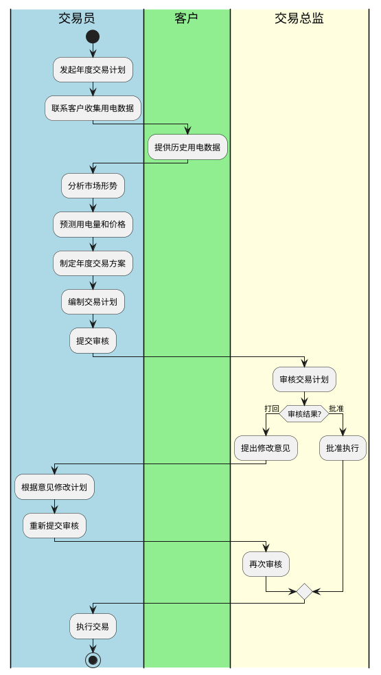
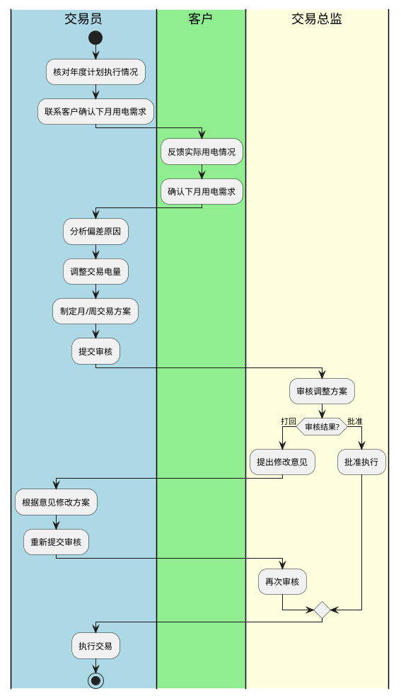
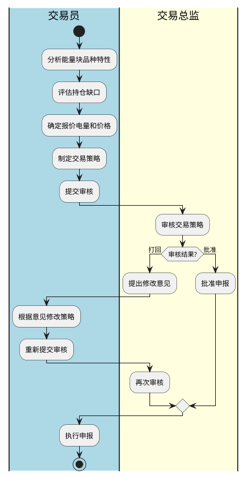
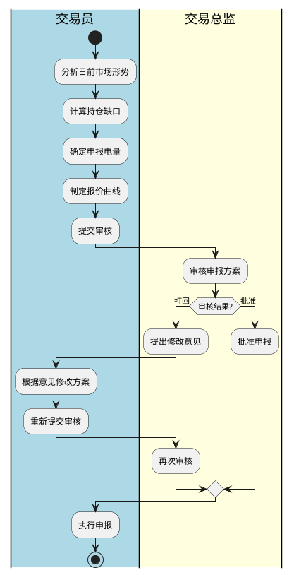

# 电力交易流程文档

## 文档说明

本文档规范售电公司电力交易业务流程，明确各角色职责。

**适用范围**：公司参与的所有电力交易市场

**文档版本**：V1.0

**生效日期**：2026年

---

## 目录

1. [年度交易计划制定流程](#1-年度交易计划制定流程)
2. [月度|周交易计划制定流程](#2-月度周交易计划制定流程)
3. [能量块交易制定流程](#3-能量块交易制定流程)
4. [日前交易申报策略制定流程](#4-日前交易申报策略制定流程)

---

## 1. 年度交易计划制定流程

### 1.1 流程概述

**目的**：基于已签约客户，制定年度电力采购计划

**触发**：每年第四季度，交易员主动发起

### 1.2 参与角色

| 角色 | 职责 |
|------|------|
| 交易员 | 收集数据、分析预测、制定计划、执行交易 |
| 客户 | 提供用电数据、确认预测结果 |
| 交易总监 | 审核计划、批准执行 |

### 1.3 流程泳道图

### 1.4 关键活动

| 活动 | 执行人 | 时限 |
|------|--------|------|
| 发起计划 | 交易员 | 每年10月 |
| 收集数据 | 交易员 | 每年10月 |
| 分析预测 | 交易员 | 每年10-11月 |
| 制定方案 | 交易员 | 每年11月 |
| 审核批准 | 交易总监 | 2个工作日 |
| 执行交易 | 交易员 | 根据交易窗口 |

---

## 2. 月度|周交易计划制定流程

### 2.1 流程概述

**目的**：根据年度计划，制定月度和周度交易执行安排

**触发**：月度计划每月下旬制定，周计划每周制定

### 2.2 参与角色

| 角色 | 职责 |
|------|------|
| 交易员 | 跟踪计划执行、调整交易策略、执行交易 |
| 客户 | 反馈实际用电情况 |
| 交易总监 | 审核调整方案 |

### 2.3 流程泳道图

### 2.4 关键活动

| 活动 | 执行人 | 时限 |
|------|--------|------|
| 核对计划 | 交易员 | 每月下旬/每周 |
| 确认需求 | 交易员 | 每月下旬/每周 |
| 调整方案 | 交易员 | 每月下旬/每周 |
| 审核批准 | 交易总监 | 1个工作日 |
| 执行交易 | 交易员 | 根据交易窗口 |

---

## 3. 能量块交易制定流程

### 3.1 流程概述

**目的**：根据能量块交易特点，制定交易策略

**触发**：能量块交易开市前

### 3.2 参与角色

| 角色 | 职责 |
|------|------|
| 交易员 | 分析能量块品种、制定报价策略、执行交易 |
| 交易总监 | 审核策略方案 |

### 3.3 流程泳道图

### 3.4 关键活动

| 活动 | 执行人 | 时限 |
|------|--------|------|
| 分析品种 | 交易员 | 开市前 |
| 评估缺口 | 交易员 | 开市前 |
| 制定策略 | 交易员 | 开市前 |
| 审核批准 | 交易总监 | 开市前 |
| 执行申报 | 交易员 | 交易窗口期 |

---

## 4. 日前交易申报策略制定流程

### 4.1 流程概述

**目的**：制定日前市场申报策略，优化报价

**触发**：每日日前市场申报前

### 4.2 参与角色

| 角色 | 职责 |
|------|------|
| 交易员 | 分析日前市场、计算申报电量、制定报价策略、执行申报 |
| 交易总监 | 审核申报方案 |

### 4.3 流程泳道图

### 4.4 关键活动

| 活动 | 执行人 | 时限 |
|------|--------|------|
| 市场分析 | 交易员 | 申报前 |
| 计算缺口 | 交易员 | 申报前 |
| 制定策略 | 交易员 | 申报前 |
| 审核批准 | 交易总监 | 申报前 |
| 执行申报 | 交易员 | 申报窗口期 |

---

## 附录

### 术语表

| 术语 | 说明 |
|------|------|
| 中长期交易 | 年度、月度等较长时间周期的电力交易 |
| 日前交易 | 提前一天进行的电力交易 |
| 能量块 | 特定时段的电力交易单元 |
| 持仓缺口 | 已售电量与已购电量的差额 |

### 通用原则

1. **交易员主导**：交易员主动发起各流程，独立执行核心工作
2. **总监审核**：重大交易计划须经交易总监审核批准
3. **客户配合**：客户响应交易员需求，提供数据和确认信息
4. **风险控制**：交易员自行评估风险，总监把控整体风险敞口

---

*文档编制：流程工程部*

*审核：*

*批准：*
